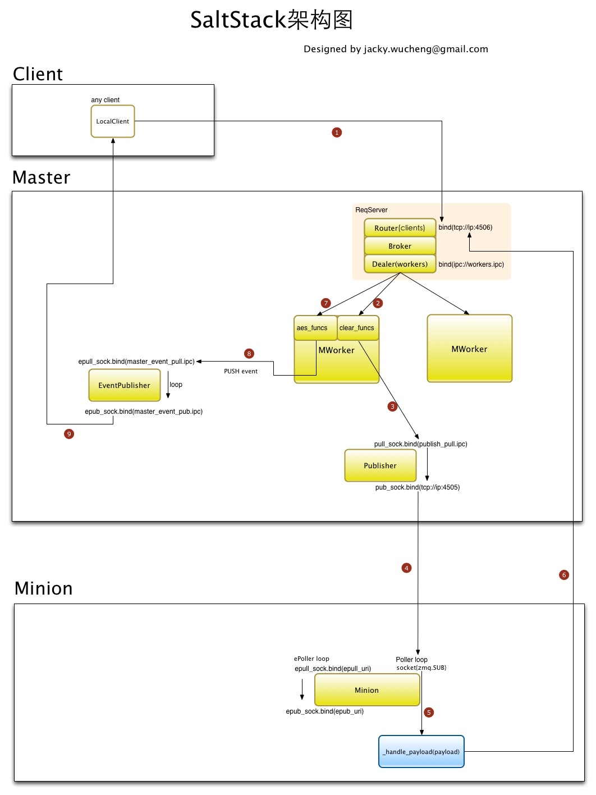
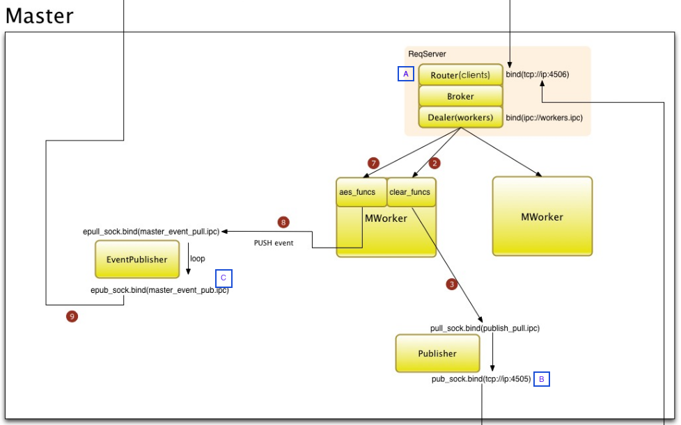

---

layout: post
title: SaltStack丢消息的根本原因
category: articles
tags: [SaltStack, ZeroMQ]
author: JackyWu
comments: true

---
## 前言

首先我们来看一下SaltStack的通信机制架构图

TODO


来自 [saltstack源码分析][]

我们可以知道，消息传输被丢失，无非出现在这些环节里

- 没写进master
- 写进master，但是给丢了
- 写进master，但是zmq传输过程给丢了
- minion收到了，但是给丢了
- minion处理完毕后返回结果给master，zmq传输给丢了
- 结果成功返回master，但是master给丢了

我们来一步步分析.

## 消息没写进master

如果消息没写进master，你使用的client会收到错误，你能感知到，重发即可。

## 消息写进master了，但是给丢了

根据[Missing Message Problem Solver][]我们知道，消息从master传输到minion使用的是zeromq的Pub/Sub通信模式，如果当你发送消息时，minion并没有连接到master上（即失联），那么该条消息对于失联的minion来说就是丢失。这并不像RabbitMQ那样，会为每个minion创建一个Queue，将消息存储在Queue里等待失联的minion连上来之后消费。

基于设计思路的不同，如果你的场景不能接受这个现象，你应该寻找saltstack之外的其他方案。

同时, 该问题没有彻底的解决方法，只有改进方法

- 方案A：确保minion跟master之间连通的稳定性
- 方案B：增加master对于高并发消息的转发稳定性

### 方案A

有2个方法：

- 通过在master上运行`salt-run manage.down`获取所有失联的minion。`manage.down`方法会给所有注册了的minion发送`test.ping`消息，如果没有反馈就认为是失联或者是进程不work。
- 通过在master上运行`salt-run manage.not_present`获取所有未连接到master的minion列表。文档里说的很清楚，该方法不会给minion发送消息，而是使用了`salt's presence detection`机制来实现的，核心思路是检查所有连接到master 4505端口上的连接，这种方法的执行效率比第一种快很多。但是从理论上来说，有可能minion确实连接着，但是进程不work，这种情况是无法被发现的。不过从实际的使用情况来看，minion本身的稳定性还不错，出现这种情况的概率极低，平时这种方法是更值得推荐的。

获取到所有不正常的minion后，用其他手段重启或者人工排查修复。

这里我们就not_present方法通过解读源码的方式说明一下原理：

```Python
    salt/salt/runners/manage.py
    not_present() <- list_not_state() <- list_state() <- salt.utils.minions.CkMinions.connected_ids()

    核心在connected_ids()中
    1. 拿到所有连接到本地`publish_port: 4505`端口上的对端ip
    2. 在master的cachedir下查找有哪些minion，这些机器被认为是合法的minion，除此之外的机器不被承认为minion
    2. 拿这些机器跟第一步获取的机器列表进行对比，可以判断出来哪些minion已经失联了
    3. 读取这些minon目录下的grains文件，从里面查找ip地址
    4. 返回失联的机器列表
```

TODO: 断线重连的配置参数

### 方案B

[ZeroMQ Pros and Cons of Pub-Sub](http://zguide.zeromq.org/page:all#Pros-and-Cons-of-Pub-Sub) 解释了这么几点

- ZeroMQ的Pub-Sub本质上是一种Multicast模型，该模型被设计用来应对超大规模集群环境，主要解决高扩展性问题，尤其适合单向发布超大规模讯息的场景, 例如现实环境中的广播电台
- 该模式带来了极大优势的同时，也引入了一些天然的缺点，例如
    - Subscribers无法告知Publishers什么时候该限流了
    - Publishers不知道Subscribers什么时候连接上来了，或者什么时候失联了（saltstack在Pub-Sub之外做到了）
    - 有可能会造成消息丢失
        - Subscribers连接上来之前所有的消息都丢失
        - Subscribers获取消息过慢，会在Sub端产生Queue，并且会过载
        - Subscribers获取到消息后未处理完成就被重启或者Crash，消息也会丢失
        - Publishers接收消息过快，Queue会过载
        - 网络负载过重，导致网络设别自动丢包
        - 网络传输过慢，导致Publishers的Queue堆积严重，然后过载丢失消息

其中，我们能控制的就是Publishers端和Subscribers端的Queue。
ZeroMQ里，不同的socket类型，有不同的Buffer，每个Buffer都是一个队列Queue, 这些队列可以有个HWM(high-water mark)参数来控制长度, 这个机制叫流量控制(Flow control)
参考这里 [High-Water Marks](http://zguide.zeromq.org/page:all#High-Water-Marks)

- PUB, PUSH 类型的socket有send buffer
- SUB, PULL, REQ, REP 类型的socket有receive buffers
- DEALER, ROUTER, PAIR 类型的socket同时有send and receive buffers

当socket里的消息队列长度达到HWM时，不同的socket类型会触发block或者drop消息的行为

- PUB和Router socket会drop消息
- 其他类型的socket会block住

同时需要注意的是，进程内通信(inproc transport)中的sender和receiver共享一个buffer，所以HWM的值是socket两端HWM的加和。

在saltstack的通信模式中，有这么几处是跟HWM有关的

TODO



saltstack官方手册的[configuration/examples](https://docs.saltstack.com/en/latest/ref/configuration/examples.html)上提到了这么几个参数

    $ The publisher interface ZeroMQPubServerChannel, 图中的B处，用来下发指令给Minion, 由Minion来Subscribe
    $pub_hwm: 1000

    $ ZMQ high-water-mark for SaltEvent pub socket, 
    $salt_event_pub_hwm: 20000

    $ ZMQ high-water-mark for EventPublisher pub socket, 图中的C处，用来发送Minion的执行结果,等待Client来Subscribe
    $event_publisher_pub_hwm: 10000

并且给出了一个大规模Minion场景下Master的参考配置

    $ On deployment with 8,000 minions, 2.4GHz CPUs, 24 cores, 32GiB memory has
    $ these settings:
    $
    $   salt_event_pub_hwm: 128000
    $   event_publisher_pub_hwm: 64000
    $   pub_hwm建议调整到：64000

Master端获取到的HWM相关配置参数有

     'event_publisher_pub_hwm': 1000,
     'pub_hwm': 1000,
     'reactor_worker_hwm': 10000,
     'salt_event_pub_hwm': 2000,
     'syndic_jid_forward_cache_hwm': 100,


你可以根据自己的服务器配置和Minion的规模进行参数调整和测试，通过合理的设置，可以有效减少丢消息的情形发生。


## 消息写进master，但是zmq传输过程给丢了

ZeroMQ的底层传输机制实现的非常漂亮，参考 [这里](http://zeromq.org/area:whitepapers), 如果你有发现底层传输丢消息的问题，可以知会我一声，我们可以一起排查。


## Minion收到了，但是给丢了

根据 [saltstack源码分析][] 中的分析，我们知道，Minion在收到来自Master的消息后，会根据配置文件里的`multiprocessing` = True/False 来启动新进程或者新线程来处理消息（默认为True）。


Minion端获取到的HWM相关配置参数有

     'event_publisher_pub_hwm': 1000,
     'pub_hwm': 1000,
     'reactor_worker_hwm': 10000,
     'salt_event_pub_hwm': 2000,
     'syndic_jid_forward_cache_hwm': 100,


TODO: minion端应该也有HWM
@tornado.gen.coroutine

## Minion处理完毕后返回结果给Master，zmq传输给丢了

同<消息写进master，但是zmq传输过程给丢了>

## 结果成功返回master，但是master给丢了

TODO: master接收minion结果是怎么做的？

## 参考资料

[Missing Message Problem Solver]:http://zguide.zeromq.org/page:all#Missing-Message-Problem-Solver
[saltstack源码分析]: http://jackywu.github.io/articles/saltstack%E6%BA%90%E7%A0%81%E5%88%86%E6%9E%90/

## Other 

we can either switch to using ROUTER-DEALER (which I tend to do for most normal volume cases)

像 puppet 这类系统也可以实现产品的发布管理，但这些系统的核心思想是配置保持，而 Ducter 是面向交互的，二者面对的问题域不一样。

对于zeromq的这种情况，pub HWM 会丢消息，可以用redis中转缓存一下。
http://rfyiamcool.blog.51cto.com/1030776/1322428

/Users/jacky/work/codebase/saltstack/salt/salt/config/__init__.py


./doc/ref/configuration/master.rst

TODO: inproc
